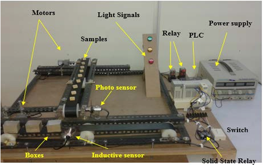
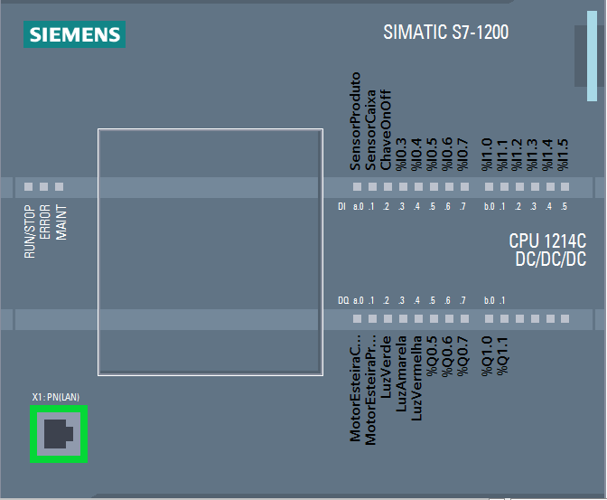
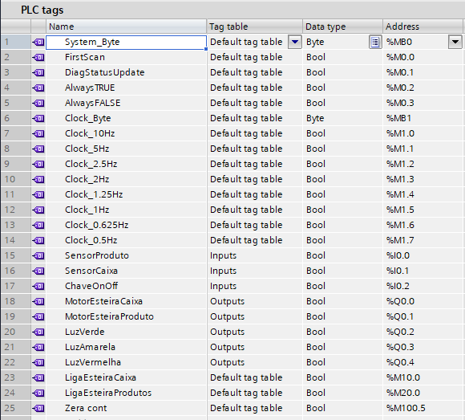

# SIEMENS_TIAPORTALV14_EMBALADORA_AUT
Automated Packaging Machine Using PLC

Passo 1: Quando a chave de alternância é pressionada para ligar, o sistema começa a funcionar movendo a correia inferior por meio de um motor DC (Y0), que carrega e traz as caixas vazias. Assim que a caixa vazia atinge o sensor indutivo (X1), o sensor indutivo é ativado e envia um sinal de volta para o PLC para interromper o movimento da correia inferior. Ao mesmo tempo em que o sistema começa a funcionar, o indicador verde acende para informar o estado do sistema ao operador. Além disso, os indicadores amarelos se acendem para indicar o movimento da correia inferior.
Passo 2: À medida que a caixa atinge a localização desejada, a correia inferior para de se mover e a correia superior começa a se mover. A correia superior começa a trazer as amostras uma por uma e as deposita na caixa. Essa operação continua até que quatro amostras tenham sido colocadas na caixa. Nesse ínterim, o indicador vermelho se acende para indicar que o sistema está empacotando. 
Um sensor fotoelétrico é usado para contar as amostras durante o processo de empacotamento. Quando a caixa é preenchida com quatro amostras, o sensor envia informações de volta para o PLC para parar a correia superior e trazer outra caixa vazia para ser empacotada. Após o sensor fotoelétrico contar quatro amostras, a correia transportadora superior para de se mover e a correia transportadora inferior começa a se mover para levar a caixa cheia e trazer outra caixa vazia para ser empacotada com mais quatro amostras.

SensorProduto	Inputs	Bool	%I0.0
SensorCaixa	Inputs	Bool	%I0.1
ChaveOnOff	Inputs	Bool	%I0.2
MotorEsteiraCaixa	Outputs	Bool	%Q0.0
MotorEsteiraProduto	Outputs	Bool	%Q0.1
LuzVerde	Outputs	Bool	%Q0.2
LuzAmarela	Outputs	Bool	%Q0.3
LuzVermelha	Outputs	Bool	%Q0.4
LigaEsteiraCaixa	Default tag table	Bool	%M10.0
LigaEsteiraProdutos	Default tag table	Bool	%M20.0
Zera cont	Default tag table	Bool	%M100.5

 
  
 
    

 
  
 
    

 
  
 
    
